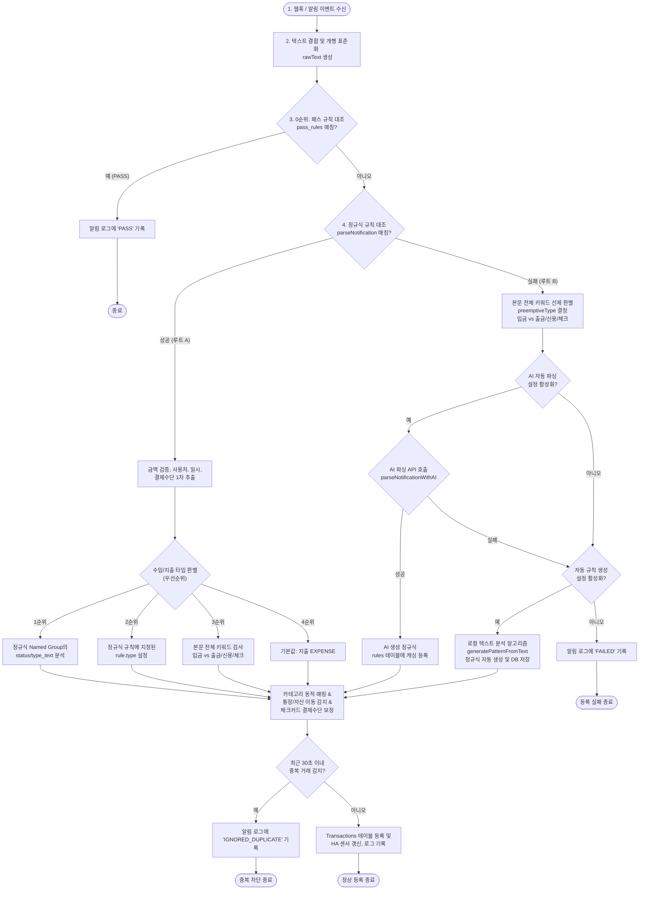

# 📊 Smart Spendlog 알림 파싱 파이프라인 흐름도

이 문서는 웹훅(Webhook) 또는 WebSocket을 통해 알림이 수신되었을 때, 전체 파싱 엔진이 어떻게 유형을 판별하고 처리 루트를 타는지 시각화한 흐름도입니다.

---

## 💡 주요 단계 설명

### 1. 패스 규칙 (0순위)
* 분석에 돌입하기 전, 사용자가 지정해 둔 광고나 단순 정보 알림성 키워드 목록(`pass_rules`)에 매칭되는지 대조하여 무의미한 AI API 호출 및 정규식 검사 자원을 즉각 아낍니다.

### 2. [루트 A] 정규식 파싱 성공 루트
* 매칭에 성공한 경우, 사용자가 작성하여 검증해 둔 정규식 규칙 정보를 최우선 적용합니다.
* **수입/지출 판별 우선순위**:
  1. 정규식 캡처 그룹 안의 상태 정보 (`status`, `type_text`에 수입/지출/취소 검출 시)
  2. 룰에 직접 명시된 수입/지출 설정 (`rule.type`)
  3. 본문 전체 키워드 선제 판독 (`preemptiveType`)
  4. 기본값인 지출 (`EXPENSE`)
* 이로 인해 사용자가 특별히 수입 룰로 등록해 둔 거래가 본문 내 카드 지시어(예: "신용")에 의해 지출로 오파싱되는 현상을 완벽히 격리합니다.

### 3. [루트 B] 정규식 파싱 실패 루트 (AI 및 자동 생성)
* 매칭에 실패해 파싱 기준이 없는 상태이므로, AI 및 자동 규칙 생성 단계로 넘어가기 직전에 **본문 전체 키워드 검사**를 즉시 수행하여 타입을 **선제 결정**합니다.
* AI 파싱 요청 프롬프트와 로컬 자동 생성 알고리즘에 이 판정된 타입 값을 넘겨주어 AI 캐싱 등록 규칙 및 로컬 임시 규칙의 데이터 정합성을 확보합니다.
